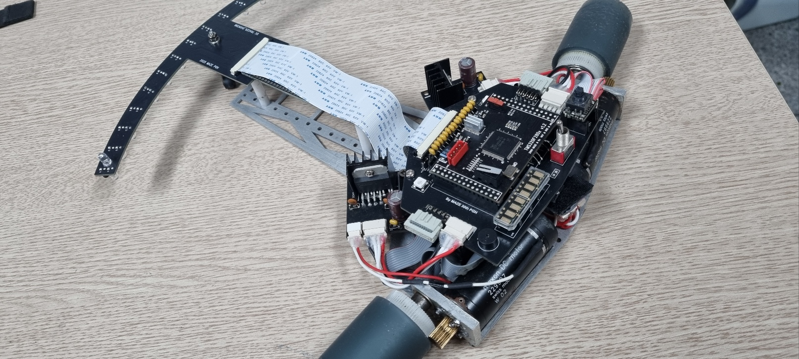
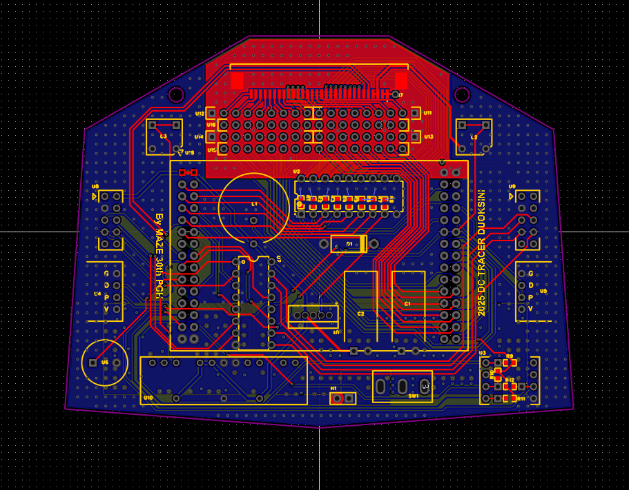
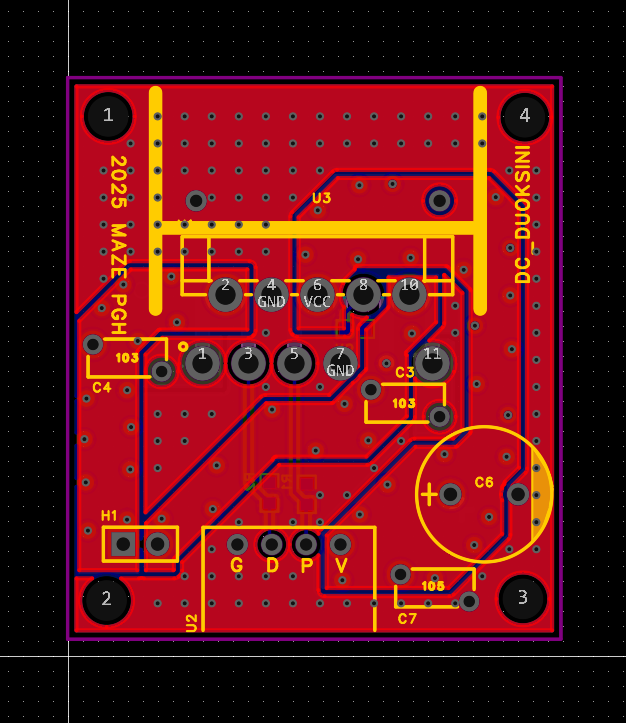

<div align="center">

# Linetracer
### Award-winning domestic competition line tracing robot platform

An integrated line tracing robot project that combines race firmware, control electronics, PCB data, and mechanical assets in a single repository.



<br />


</div>

---

## Overview

`Linetracer` is a high-speed autonomous line tracing robot built for major domestic competition tracks in Korea. Like `JP_Robotrace`, this repository is not limited to firmware alone. It also preserves PCB design assets, logic references, mechanical models, manufacturing data, and supporting monitor firmware, making it a complete engineering archive rather than a source-only project.

At its core is a TI C2000-based control platform tuned for aggressive line following, sensor-driven motion control, and repeatable race setup. The repository captures both the competition robot itself and the surrounding hardware and tooling required to build, inspect, and maintain it.

---

## Competition History

This robot platform was developed for domestic line tracing competitions in Korea and achieved top awards across multiple events.

- **Grand Prize** - 20th National Intelligent Robot Competition
- **Grand Prize** - 26th National Line Tracer Contest
- **Excellence Award** - 14th Robot Fusion Festival

Those results position `Linetracer` as an award-winning competition robot archive, documenting a platform that was proven on real race tracks rather than only in development environments.

---

## Gallery

<table>
  <tr>
    <td width="50%">
      
    </td>
    <td width="50%">
      
    </td>
  </tr>
  <tr>
    <td width="50%">
      
    </td>
    <td width="50%">
      
    </td>
  </tr>
</table>

<p align="center">
  <sub>Competition hardware, mechanical design, and board-level implementation are preserved together in one repository.</sub>
</p>

---

## Key Features

- High-speed line tracing firmware built for domestic competition environments
- Multiple run profiles including search, fast run, extreme run, and bril run
- Closed-loop control using sensor input, motor feedback, and dedicated DSP support code
- Separate monitor firmware for inspection, flash handling, and display-oriented tooling
- Hardware resources including EasyEDA projects, PADS sensor board data, logic PDFs, and Gerber outputs
- Mechanical assets including assembly visuals, robot photography, and printable STL models

---

## Project Structure

```text
Linetracer/
├── Docs/                    # Component documents and technical references
├── Hardware/                # PCB design data, board images, Gerbers, and logic docs
│   ├── EasyEDA/
│   ├── Gerber/
│   ├── Logic/
│   └── PADS/
├── Mechanics/               # Mechanical assets, photos, and STL models
│   └── STL/
└── Software/                # Race firmware and monitoring firmware
    ├── _Vistan_/
    └── monitor_2809/
```

---

## Software Layout

The main race-oriented source lives under `Software/_Vistan_/main/`, where the firmware is organized around direct embedded functionality instead of layered abstractions. Important files visible in the project include:

- `main.c` - system initialization and runtime control entry point
- `Motor.c` - motor drive and motion control logic
- `sensor.c` - line sensor processing
- `search.c` - search-oriented driving behavior
- `fastrun.c` - high-speed tracing mode
- `extremerun.c` - aggressive race profile
- `brilrun.c` - top-end performance run mode
- `menu.c` - local configuration and menu flow
- `flash.c` - flash-related handling
- `VFD.c` - display output control
- `LS7166.c` - external counter or encoder-related handling

The repository also includes a separate `Software/monitor_2809/` project with its own build flow and files such as `flash.c`, `LCD.c`, and `VFD.c`, which suggests a dedicated monitoring or support firmware used alongside the main racer platform.

From the shipped makefiles, the firmware targets include `a_Vistan` and `a_DOUKSINI`, and the codebase is built around a TI C2000 toolchain layout with Source Insight-era project artifacts still preserved.

---

## Hardware

This repository also captures the electrical and manufacturing side of the robot.

- `Hardware/EasyEDA/` contains editable board projects and preview images for the main board and motor driver
- `Hardware/PADS/` contains sensor board layout data and image assets
- `Hardware/Logic/` contains circuit reference PDFs for the main board, motor driver, and sensor board
- `Hardware/Gerber/` preserves manufacturing-ready outputs

That combination makes the repository useful for rebuilding the robot electronics, not only for reading the firmware.

---

## Mechanical Assets

The `Mechanics/` directory includes both presentation material and fabrication-oriented assets.

- `Assembly.png` shows the chassis and mounting layout as a CAD-style assembly
- `Tracer.jpg` captures the real competition robot with exposed electronics and front sensor structure
- `STL/` stores printable or reference geometry such as `BaseBoard.STL`, `Wheel.STL`, `Gear.STL`, `Pinion.STL`, and `RE25_MotorGuard.STL`

This makes the repository valuable for understanding both the robot architecture and the practical mechanical packaging used in competition.

---

## Technology Snapshot

| Category | Details |
|---|---|
| MCU Family | Texas Instruments `TMS320F2808` / `TMS320F2809` |
| Firmware Language | `C`, `Assembly` |
| Editor | Source Insight |
| Build Configuration | TI C2000-oriented make flow |
| Build Targets | `a_Vistan`, `a_DOUKSINI` |
| Repository Scope | Firmware, PCB, Gerber, STL, logic docs, component references |

---

## Run Modes and Support Tools

Based on the preserved source layout, the project includes several competition driving strategies as well as supporting maintenance tools.

- **Search** for line acquisition and controlled recovery
- **Fast Run** for higher-speed race operation
- **Extreme Run** for aggressive performance tuning
- **Bril Run** for an additional top-end driving profile
- **Monitor Firmware** for flash, LCD, and VFD-centered support workflows

This split suggests a development workflow that separated race execution from monitoring, setup, or maintenance utilities.

---

## Build Notes

The repository contains source, project files, and make configuration, but it does not yet provide a modern step-by-step setup guide.

What can be verified from the repository:

- The project is built around a TI C2000 embedded platform
- `Software/_Vistan_/main/MAKEFILE` identifies the target as `a_Vistan`
- `Software/monitor_2809/main/MAKEFILE` identifies the target as `a_DOUKSINI`
- The source tree preserves an IAR- and Source Insight-era embedded workflow

What is still undocumented:

- Exact flashing procedure for each firmware target
- Required debugger, programmer, or download environment
- Board assembly and wiring sequence
- Parameter tuning flow for different tracks and competitions

---

## Why This Repository Is Interesting

Many line tracing repositories preserve only code or only hardware snapshots. `Linetracer` is interesting because it keeps the full competition story together: race firmware, monitor utilities, board design data, mechanical assets, and a documented award history from domestic competitions.

For anyone studying high-speed line tracers, DSP-based embedded control, or full-stack robot competition workflows, this repository is a compact record of how a proven Korean competition robot was designed and maintained.

---

## Credits

From the primary race firmware make configuration:

- **Author:** Yuk Keun Ho
- **Company:** MAZE

---

## License

This repository does not currently include a standalone license file. Add one if you want to make reuse terms explicit.
