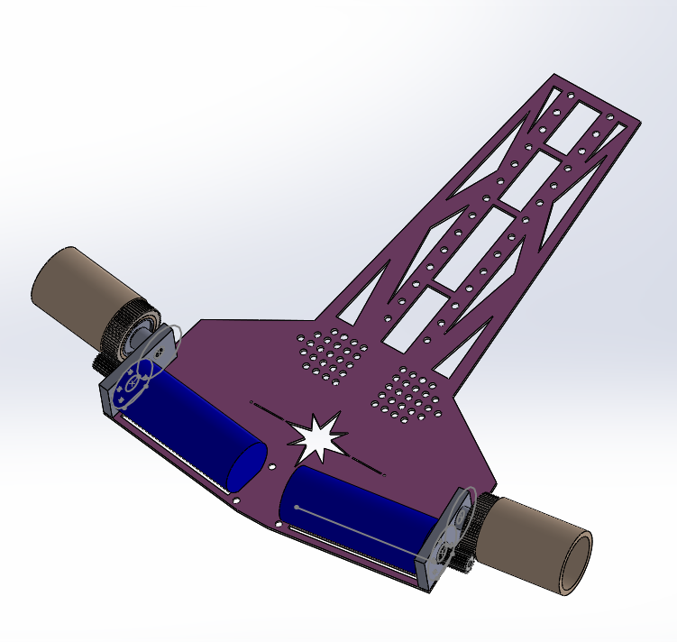

<div align="center">

# JP_Robotrace
### Competition-grade line tracing robot platform

A complete robot tracing project that brings together firmware, electronics, and mechanical design in one repository.


<br />


</div>

---

## Overview

`JP_Robotrace` is a line tracing robot project built for high-speed autonomous racing. The repository does not only contain firmware. It also includes PCB design data, manufacturing outputs, mechanical assets, and component references, which makes it closer to a full robot platform archive than a source-only codebase.

At the center of the project is a TI C2000-based control system tuned for fast and stable line following, with dedicated run modes, sensor processing, motion control, and board-level hardware design captured together in one place.

---

## Gallery

<table>
  <tr>
    <td width="50%">
      
    </td>
    <td width="50%">
      
    </td>
  </tr>
  <tr>
    <td width="50%">
      
    </td>
    <td width="50%">
      
    </td>
  </tr>
</table>

<p align="center">
  <sub>Event identity, mechanical design, real hardware, and board-level engineering all live in the same archive.</sub>
</p>

---

## Key Features

- High-speed line tracing firmware for competitive robot racing
- Multiple driving modes including search, fast run, extreme run, and bril run
- Closed-loop motion control using encoder and sensor feedback
- Dedicated modules for motor control, gyro handling, flash, menu, and display
- Hardware resources including EasyEDA projects and production Gerber files
- Mechanical assets including STEP models and assembled robot visuals

---

## Project Structure

```text
JP_Robotrace/
├── Docs/                    # Component documents and technical references
├── Hardware/                # PCB design files, Gerbers, and logic references
│   ├── EasyEDA/
│   ├── Gerber/
│   └── Logic/
├── Mechanics/               # Mechanical assets, photos, and STEP models
│   └── STEP/
└── Software/                # Embedded firmware source and toolchain files
    ├── Compiler/
    ├── include/
    └── main/
```

---

## Software Layout

The embedded source is centered in `Software/main/`, where the project is split by function instead of by abstraction-heavy layers. Important files include:

- `main.c` - system initialization and core runtime setup
- `Motor.c` - motor control logic
- `Sensor.c` - sensor processing for line detection
- `gyro.c` - gyro interface and related handling
- `Search.c` - search-oriented run logic
- `Fastrun.c` - faster race mode logic
- `Extremerun.c` - aggressive run profile
- `brilrun.c` - high-performance run mode
- `Menu.c` - local interface and configuration flow
- `flash.c` - flash memory handling
- `VFD.c` - display output control

The source was written with Source Insight as the editing environment, and the shipped `Software/main/MAKEFILE` identifies the output target as `a_ZILLIIAX` while referencing a TI C2000-oriented IAR build chain and supporting libraries.

---

## Hardware

This repository also preserves the electrical side of the robot.

- `Hardware/EasyEDA/` contains editable PCB project files and preview images
- `Hardware/Gerber/` contains manufacturing-ready archives for the boards
- `Hardware/Logic/` contains supporting circuit reference documents

---

## Mechanical Assets

The `Mechanics/` directory includes both presentation assets and 3D geometry.

- `Assembly.png` shows the assembled system
- `MM2025_RT51.jpg` captures the robot in a real-world setting
- `STEP/` stores mechanical models such as wheel, gear, tire, and assembly data

That combination makes the repository useful not only for firmware study, but also for reconstructing the full build context of the robot.

---

## Technology Snapshot

| Category | Details |
|---|---|
| MCU | Texas Instruments `TMS320F2808` |
| Firmware Language | `C`, `Assembly` |
| Editor | Source Insight |
| Build Configuration | TI C2000 / IAR-oriented make flow |
| Build Target | `a_ZILLIIAX` |
| Repository Scope | Firmware, PCB, Gerber, STEP, reference docs |

---

## Run Modes

Based on the source layout, the project includes several driving strategies with separate implementations:

- **Search** for controlled exploration and line acquisition
- **Fast Run** for higher-speed tracing
- **Extreme Run** for more aggressive motion profiles
- **Bril Run** for a top-end performance-oriented mode

This mode separation suggests a workflow that balances stability, route understanding, and maximum race pace.

---

## Build Notes

The repository contains source and make configuration, but it does not yet provide a polished step-by-step setup guide.

What can be verified from the repository:

- The firmware is built around a TI C2000 target
- The codebase was written with Source Insight as the editing environment
- `Software/main/MAKEFILE` references the IAR C2000 compiler, assembler, and linker
- The output target name is `a_ZILLIIAX`

What is still undocumented:

- Exact flashing procedure
- Required debugger or programmer hardware
- Board assembly and bring-up sequence
- Parameter tuning procedure for different tracks

---

## Why This Repository Is Interesting

Many robot repositories show only one slice of the work. `JP_Robotrace` is interesting because it keeps the full engineering story together: embedded control, electronics, manufacturing data, and mechanical design.

For anyone studying line tracing robots, embedded control systems, or complete competition robot workflows, this repository is a compact snapshot of how those disciplines come together in practice.

---

## Credits

From the project make configuration:

- **Author:** Yuk Keun Ho
- **Company:** MAZE

---

## License

This project is released under the `MIT` License. See `LICENSE` for details.
